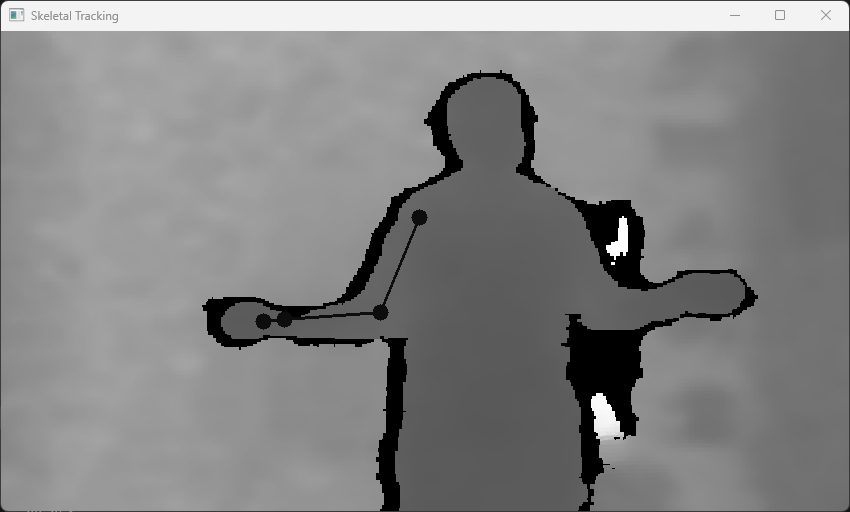
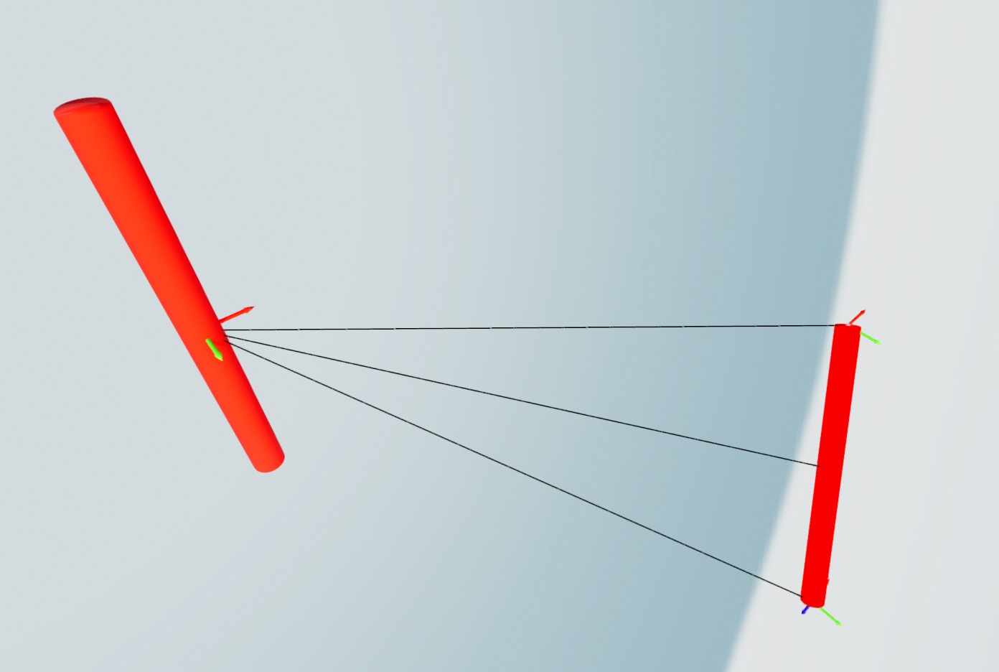
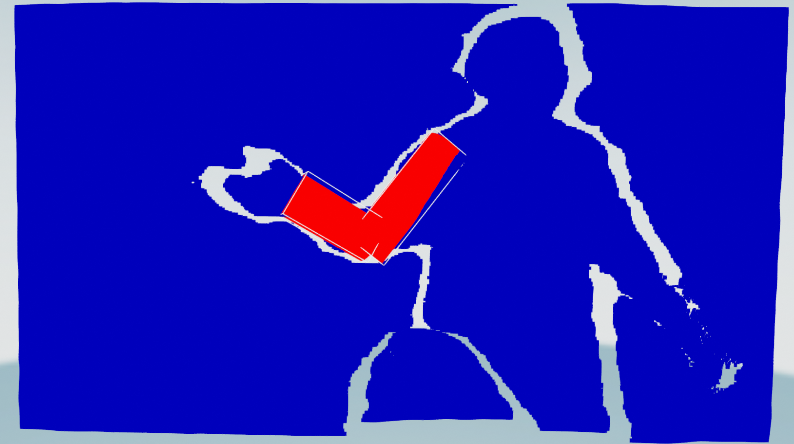
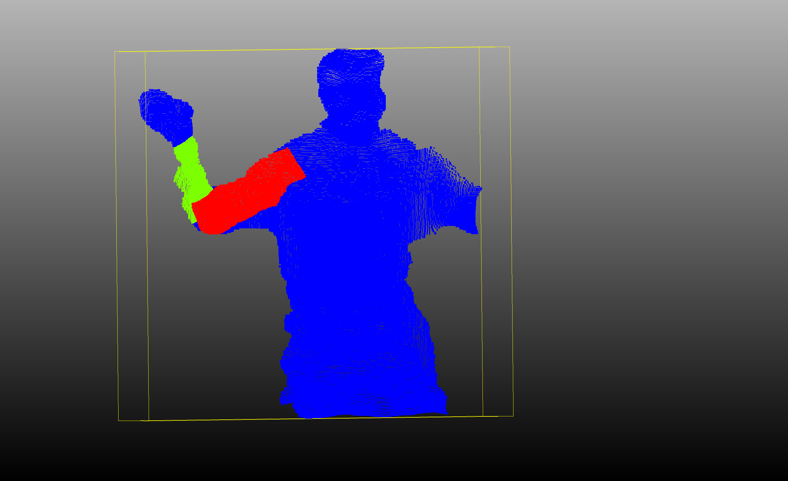

# Segmentation of a Human Arm in Point Clouds using Nuitrack

This repository contains the code for the segmentation of a human arm in point clouds using the Nuitrack SDK. The code heavily relies on [Nuitrack SDK](https://nuitrack.com/) and the [Open3D](http://www.open3d.org/) library. The code was written using Python 3.9.16 and was tested on Windows 10/11.

Prerequisites:
- Nuitrack SDK 
- Intel RealSense D435i
- Intel Realsense SDK 
- Nvidia GPU with CUDA support
  
Results:

## Python Setup 
- Conda environment setup
    - Create a new Conda environment using the following command: `conda create -n nuitrack python=3.9.16`
    - Activate the Environment using the following command: `conda activate nuitrack`
- Install the following packages
    - `pip install open3d`
    - `pip install numba`
    - `pip install opencv-python`
    - `pip install tqdm`
    - `pip install torch`
    - The current PyNuitrack version from the Nuitrack github repo under the link: [PyNuitrack](https://github.com/3DiVi/nuitrack-sdk/tree/master/PythonNuitrack-beta)
    - `pip install tqdm`
    - `pip install torch`

## Class Names
- 0: Background
- 1: Forearm
- 2: Upper Arm

## File Structure
- nuitrack_2d.py: Contains the code for saving joint, color and depth data from the Nuitrack SDK aswell as the code for 2D visualization of the data.
- nuitrack_3d.py: Contains the code for Live 3D visualization of the data from the Nuitrack SDK.
- Visualize_saved_points.py: Contains the code for visualizing the saved joint, color and depth data from the Nuitrack SDK.
- label_and_save_pcds.py: Goes through the saved joint, color and depth data and labels the arm and saves the point clouds in .ply or .csv format.